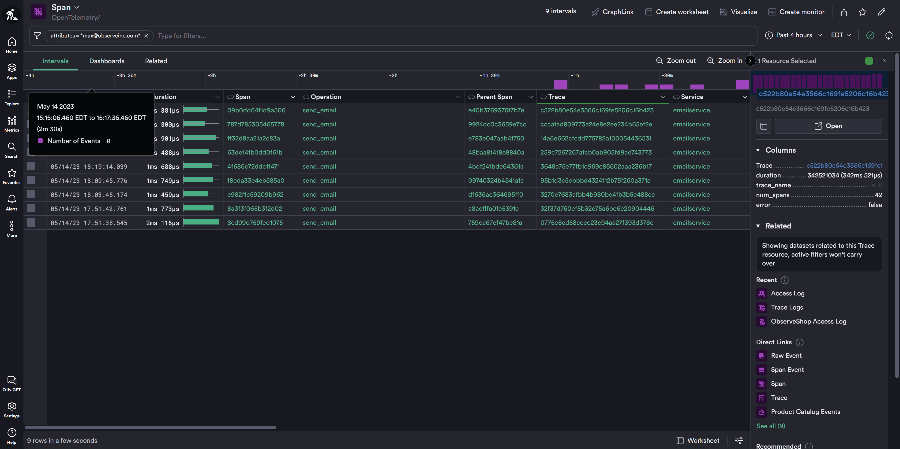

# observeshop-playwright

For up-to-date instructions on creating, deploying and managing playwright scripts, see [Playwright documentation](https://playwright.dev/docs/intro)

> ❗ Following instructions are for `Ubuntu 22.04.3 LTS (Jammy Jellyfish)` and `Node v18.16.0`. Instructions may vary for different OS and Node versions.

> ❗ I am using my own user `max` here. For more production setup, create a dedicated playwright user. (Perhaps consider `/usr/sbin/nologin` for the shell?)

## Install node, playwright and required libraries

On a VM that has acccess to the URLs that you are targetting with Playwright scripts, execute the following commands:

```sh
curl -o- https://raw.githubusercontent.com/nvm-sh/nvm/v0.39.1/install.sh | bash
source ~/.bashrc
nvm install v18.16.0
sudo apt-get install -y libgtk-3-0 libasound2 libxcomposite1 libxdamage1 libxfixes3 libxrandr2 libxrender1 libxtst6 libpangocairo-1.0-0 libpango-1.0-0 libatk1.0-0 libcairo-gobject2 libcairo2 libxcb-shm0 libx11-xcb1 libxcursor1 libxi6 libgbm1
```

## Initialize playwright directory 

```sh
sudo mkdir -p /opt/playwright/
sudo chown -R max.max /opt/playwright/

cd /opt/playwright
npm init playwright@latest
```

## Create playwright script

Create file `/opt/playwright/tests/observeshop.1.spec.ts` with the following contents:

```ts
import { test, expect } from '@playwright/test';
import { setTimeout } from "timers/promises";

test('can purchase an item', async ({ page }) => {
  await page.goto('https://www.observeshop.com/');
  await page.getByRole('button', { name: 'Go Shopping' }).click();
  await page.getByText('National Park Foundation Explorascope').click();
  await page.getByRole('button', { name: 'cart Add To Cart' }).click();
  await page.locator('#email').click({
    clickCount: 3
  });
  await page.locator('#email').fill('max@observeinc.com');
  await page.getByRole('button', { name: 'Place Order' }).click();
  await setTimeout(10000);
});
```

# Create scripts to run from crontab

Put the script in `/opt/playwright/run-observeshop.1.spec.ts.sh`

```sh
#!/bin/bash

export PATH=$PATH:/home/max/.nvm/versions/node/v18.16.0/bin
export FORCE_COLOR='false'

exec_dir="/opt/playwright/tests"
cd ${exec_dir}

npx playwright test observeshop.1.spec.ts --workers 3
```

Set correct permissions for the `/opt/playwright/run.sh` script
```sh
chmod 755 /opt/playwright/run-observeshop.1.spec.ts.sh
```

Add the following line to your crontab with `crontab -e` to run the synthetic test every 5 min (or however often you desire):

```crontab
*/5 * * * * /opt/playwright/run-observeshop.1.spec.ts.sh
```

## Cleanup (optional)

Remove the example script

```sh
rm /opt/playwright/tests/example.spec.ts
```

## Validate

Validate that tests are running by searching for the email you specified in the test in the OTEL spans in Observe:


